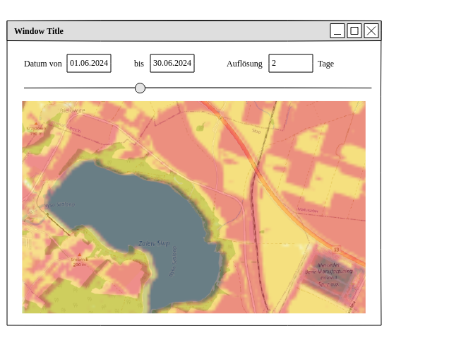

# Projekt Hotspot

Umsetzung einer Projektidee aus dem [Hackaton 2024]

## Einleitung

**Challenge: Identifizierung von Hitzeproblembereichen im Kontext der städtischen Wärmeplanung**

Städte werden mit Blick auf den Klimawandel immer heißer. In Folge gibt gewisse Hotspots in den Städten, die sich überhitzen und die das Leben der Einwohner immer schwieriger machen. Mit verschiedenen Maßnahmen, wie bsp. zusätzliche Begrünung, Beschattung oder Entsiegelung jener Flächen, soll Lebensqualität in urbanen Räumen gezielt verbessert und die negativen Auswirkungen des Klimawandels gemindert werden.

## Zielsetzung

Zie ist es automatisiert eine Heatmap für Städte zu erstellen. Für die Berechnung der dafür notwendigen Daten sollen frei verfügbare Daten verwendet werden.
Das Ergebnis soll Stadtplanern und Kommunen ermöglicht, den Prozess der Erreichung von Klimazielen zu vereinfachen. 

## Ausgangslage

Aktuell ist das Erstellen solcher Heatmaps sehr aufwendig und erfordert spezielle Software und Fachwissen, sowie manuelle Eingriffe. Unter Umständen gibt es bereits Lösungen, die Heatmaps für geografische Regionen automatisiert erstellen, auf die haben wir jedoch keinen Zugriff.

Es existieren viele verschiedene Datenquellen, die aktuelle Daten über geografische Gebiete liefer, zum Beispiel Satellitenbilder, Wetterdaten, Verkehrsdaten, Open-Street-Map-Daten und viele mehr. Diese Daten können über APIs abgerufen werden. Je nach Datenquelle liegen diese Daten in verschiedene Formaten und Auflösungen vor.

## Vorgehensweise

Es wurde geprüft, welche Satelliteninformationen zur Verfügung stehen und welche Daten diese liefern. Als geeignete Datenquelle wurde der [Copernicus-Browser] festgelegt.
welche Daten für die erstellung einer Heatmap geeignet sind und welche Quellen diese liefern. 

Aufteilung in 3 Bereiches
- Ansprechen der Copernicus-API, für einen automatischen Download der Daten
- Analyse, welche Daten der Satelliten für die Berechnungen geeinget sind und wie diese verarbeitet werden müssen um Aussagekräftig zu sein
- Möglichkeiten der Visualisierung der Daten prüfen

### Umsatzung API Abruf

### Umsetzung Datenanalyse

- nicht triival
- Problem Wolkendecke
- Wie funktioniert die IR Messung eines Satelliten. Muss der Strahl genau senkrecht sein? Problem bei Dachfächen

###  Visualisierung

- Darstellung eines Kartenausschnittes per OpenStreetMap
- Auswahl eines Datumsbereichs und einer Auflösung, welche Aufnahmen mehrerer Tage zusammenfasst
- Darstellung der verschiedenen Tage durch Slider oder Animation
- Ergänzen der Wetterinformationen für den Bereich an dem Tag

#### Ergebnis 

- Eine erste Idee wie eine einfache Visualisierung aussehen könnte
- mit Hilfe von Java-Script Bibliotheken wie [leafletjs], [geotiffjs] und  [georaster] lassen sich einfach die Daten von Open-Streetmap und Layerinformationen im GeoTiff-Format darstellen.
- erste Beispiele wie die verfügbaren Libraries zur Visualisierung genutzt werden können sind unter `/src/main` zu finden.

# Probleme 
-grobe Auflösung
Datenquellen ermitteln
- Infrarot-Reflektionen eignen sich nur bedingt für die Ermittlung der Temperatur. Darüber lassen sich eher Rückschlüsse auf die Bebauung und den Boden schließen. Verschiedene Frequenzen, liefern unterschiedliche Werte. So reflektiert Wasser besonders stark, Betong aber auch stark. Grünflächen absorbieren stärker

## weiterführende Schritte, weitere Ideen

### Kommerzielle Anbieter
Gibt es kommerzielle Anbieter die bereits eine automatisierte "Thermal Sharpening" Lösung anbieten, um Heatmaps mit Satellitendaten zu erstellen? 

Welche Möglichkeiten gibt es noch um auf besser aufgelöste Daten zurückgreifen zu können. Welche Anbieter gibt es die höher aufgelöste Daten anbieten? Welche Sattelitendaten sind noch geeignet um Rückschlüsse auf die Temperatur zu ziehen?

Welche Möglichkeiten gibt es eine Heatmap mit einer Drohne für ein spezifisches Gebiet zu erstellen? Welche Kosten und Probleme ergeben sich daraus?

### Auswertung der Satellitendaten verbessern

Prüfen welche Möglichkeiten es gibt mithilfe von KI die verschiedenen Satellitendaten auszuwerten, um eine Klassifizierung der verschiedenen Oberflächen zu erstellen. Mit der Klassifizierung der einzelnen Bereiche lassen sich dann auch genauere Rückschlüsse auf die Temperatur beziehungsweise mögliche Hotspots ziehen.

## Ergebnis

Wir haben gezeigt, dass viele Daten frei verfügbar sind und sich automatisiert abrufen lassen. Diese können mit wenig Aufwand für die Visualisierung für geo-referenzierte Daten genutzt werden. Die notwendigen Libraries dazu sind frei verfügbar und einfach zu nutzen.

Die Herausforderung besteht darin die verfügbaren Daten zusammenzuführen und Zusammenhänge zwischen den erfassten Daten und der Temperatur zu ermitteln. Hierfür ist mehr Fachwissen und Zeit notwendig, um die Daten zu analysieren und die richtigen Schlüsse daraus zu ziehen.

## Quellen

[Copernicus-Browser] : https://browser.dataspace.copernicus.eu/ "Copernicus Browser"
[copernicus]: https://www.copernicus.eu/en "Copernicus"
[openstreetmap]: https://www.openstreetmap.org/ "OpenStreetMap"
[geoserver]: https://www.geoserver.org/ "GeoServer"
[chatgpt]: https://chat.openai.com/ "ChatGPT"
[claudeai]: https://claude.ai/ "Claude AI"
[leafletjs]: https://leafletjs.com/ "Leafletjs"
[geotiffjs]: https://geotiffjs.github.io/ "Geotiffjs"
[georaster]: https://github.com/GeoTIFF/georaster "Georaster"
[qgis]: https://qgis.org/en/site/ "QGIS"
[Hackaton 2024]: https://hackathon2024.digitale-oberlausitz.eu/ "Hackaton 2024"

